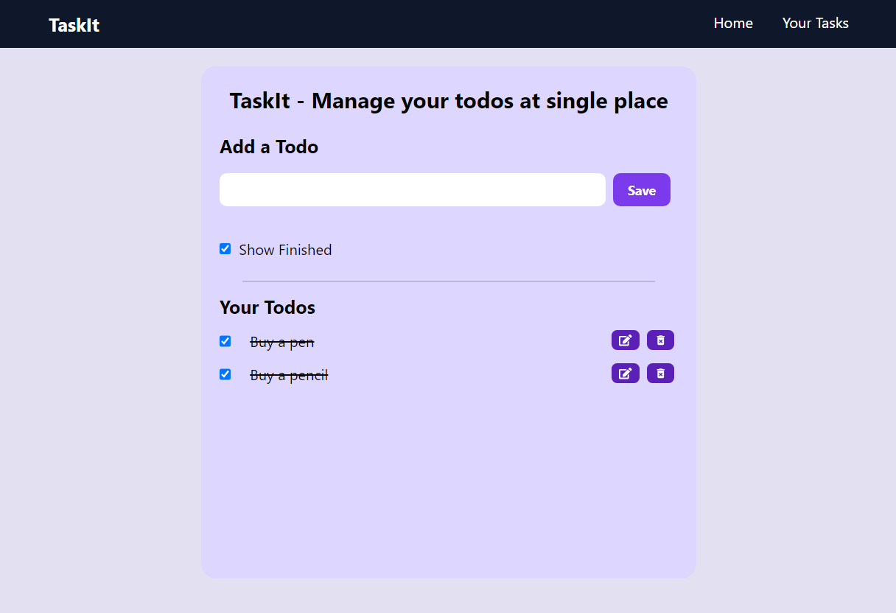
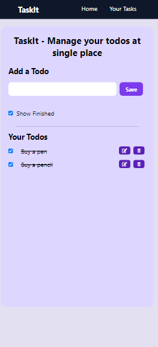

# Todo App

This repository contains the source code for a Todo app built using ReactJS and Vite. The app is fully functional and responsive, allowing users to add, strike out, and manage tasks efficiently.

## Live Demo

Check out the live demo of the project:

https://github.com/user-attachments/assets/aff00f55-d01f-443d-b38d-133f2d6ce162

## Features

- **Responsive Design**: The app is fully responsive and works seamlessly on various devices and screen sizes.
- **Task Management**: Users can add new tasks, strike out completed tasks, and delete tasks.
- **Modern Technologies**: Built with ReactJS and Vite, ensuring fast performance and a smooth development experience.

## Screenshots

  

